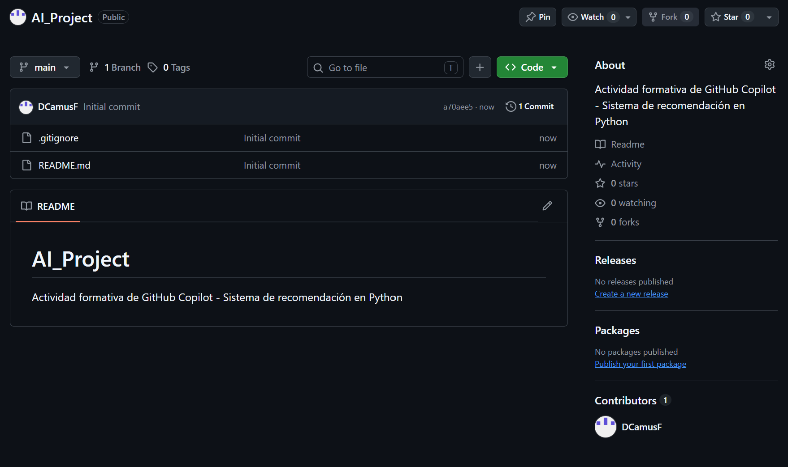
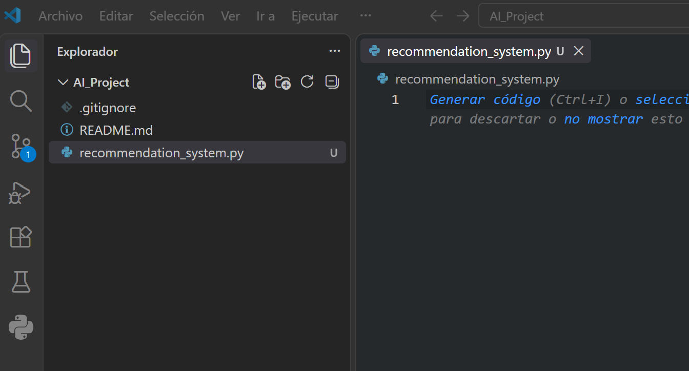
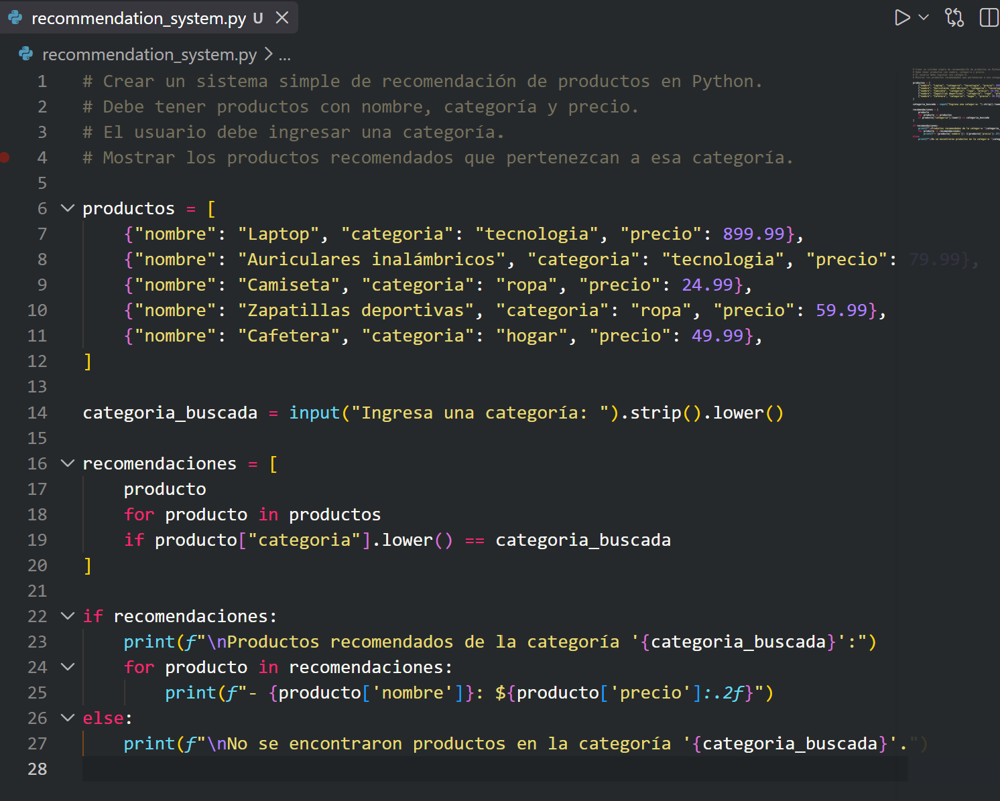
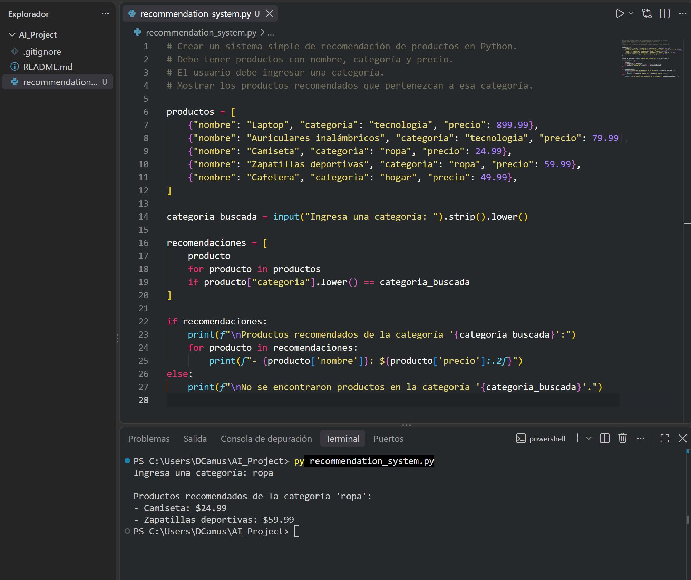

# AI_Project

## Actividad formativa: GitHub Copilot

Este proyecto fue desarrollado como parte de una actividad formativa de INACAP relacionada con tendencias emergentes de Inteligencia Artificial y el uso de GitHub Copilot.

## Objetivo

El objetivo del proyecto es utilizar GitHub Copilot como herramienta de apoyo para generar código en Python y desarrollar un sistema simple de recomendación de productos.

## Herramientas utilizadas

- GitHub
- GitHub Copilot
- Visual Studio Code
- Python
- Git

## Desarrollo del proyecto

### 1. Creación del repositorio

Se creó un repositorio público en GitHub llamado `AI_Project`.



### 2. Clonación del repositorio

El repositorio fue clonado localmente utilizando Visual Studio Code y Git.

Se utilizó el siguiente comando:

```bash
git clone https://github.com/DCamusF/AI_Project.git
```

Luego se ingresó a la carpeta del proyecto mediante:

```bash
cd AI_Project
```



### 3. Creación del archivo Python

Dentro del proyecto se creó el archivo:

```text
recommendation_system.py
```

En este archivo se escribieron comentarios indicando las características que debía tener el programa.

### 4. Uso de GitHub Copilot

Se utilizó GitHub Copilot para generar el código inicial del sistema de recomendación a partir de instrucciones escritas como comentarios.

El programa contiene productos con:

- Nombre
- Categoría
- Precio

El usuario puede ingresar una categoría y el sistema muestra los productos disponibles pertenecientes a dicha categoría.



### 5. Ejecución del programa

El programa fue ejecutado desde la terminal integrada de Visual Studio Code utilizando:

```bash
py recommendation_system.py
```

Durante la prueba se ingresó la categoría:

```text
ropa
```

El programa mostró correctamente los productos correspondientes:

```text
Productos recomendados de la categoría 'ropa':
- Camiseta: $24.99
- Zapatillas deportivas: $59.99
```



## Resultado

El sistema de recomendación funcionó correctamente.

La actividad permitió utilizar GitHub Copilot como herramienta de Inteligencia Artificial para apoyar la generación de código en Python y posteriormente ejecutar y comprobar el funcionamiento del programa.

## Autor

**Daniel Camus**  
Ingeniería en Informática  
INACAP